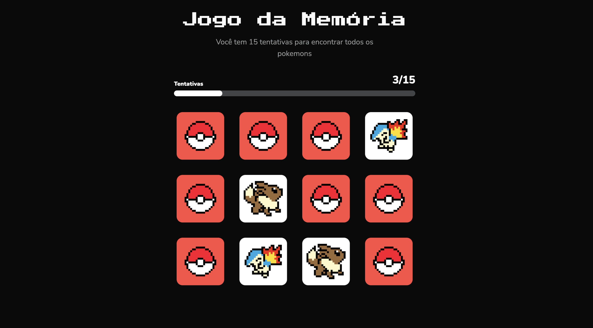

# 📌 Nome do Projeto

Um app de tarefas simples para organizar o dia a dia, feito com React e TypeScript.

---

## 📚 Sumário

- [🚀 Tecnologias utilizadas](#-tecnologias-utilizadas)
- [📸 Demonstração](#-demonstração)
- [🧰 Instalação](#-instalação)
- [🙋‍♀️ Como contribuir](#-como-contribuir)
- [📄 Licença](#-licença)
- [✨ Autor](#-autor)

---

## 🚀 Tecnologias utilizadas

- [React](https://react.dev)
- [Vite](https://vite.dev)
- [Tailwindcss](https://tailwindcss.com/)

---

## 📸 Demonstração



---

## 🧰 Instalação

```bash
# Clone o repositório
git clone https://github.com/brendamatias/seu-projeto.git

# Acesse a pasta do projeto
cd seu-projeto

# Instale as dependências
npm install

# Rode o projeto localmente
npm run dev
```

---

## 🙋‍♀️ Como contribuir

1. Faça um fork do repositório
2. Crie uma branch: `git checkout -b minha-feature`
3. Commit suas mudanças: `git commit -m 'feat: Minha nova feature'`
4. Faça push para sua branch: `git push origin minha-feature`
5. Crie um Pull Request

---

## 📄 Licença

Este projeto está sob a licença [MIT](./LICENSE).

---

## ✨ Autor

Feito com 💜 por [Brenda Matias](https://github.com/brendamatias)
[🔗 LinkedIn](https://www.linkedin.com/in/brendamatias/)
